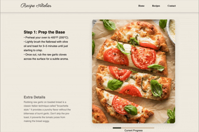

# README.md

# Recipe Atelier 

## 1. Project Overview
**Recipe Atelier** is a web based culinary platform designed to provide a studio like environment for exploring recipes.

## 2. Setup and Installation
To get a local copy up and running, follow these steps:

1.  **Clone the repo**
    ```bash
    git clone https://github.com/ldanielgg/recipe-studio.git
    ```
2.  **Navigate to the project directory**
    ```bash
    cd recipe-studio
    ```
3.  **Launch the site**
    Simply open `index.html` in your preferred web browser.

## 3. Visual Gallery

| Landing Page | Recipe List Page | Detailed Recipe Guide |
| :---: | :---: | :---: |
|  |  |  |
---

## 4. Project Structure
The repository is organized to ensure maintainability and clear separation of website sections:

```text
recipe-studio/
├── index.html                  # Homepage
├── recipes.html                # Recipe list page
├── contact.html                # Contact page
├── styles.css                  # Unified stylesheet
├── recipes/                    # Recipe detailed guide pages
│   ├── beef-bourguignon.html
│   ├── salmon-nigiri.html
│   ├── shakshuka.html
|   └──...
└── images/                     # Website images